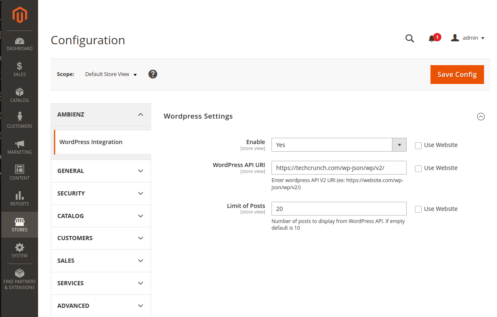
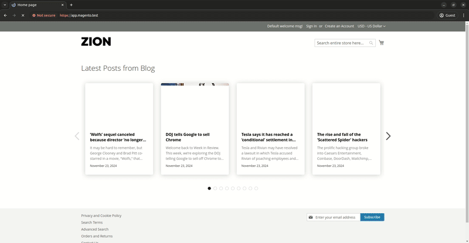

# Ambienz_MageWP

Este módulo permite que você integre o WordPress ao Magento 2.

#### Configurações

#### Exibição no Frontend

## Features

- **Post Carousel:** Exibe um carrossel dos posts mais recentes do wordpress como ultimo elemento da página.

## Instalação

Para instalar o módulo, siga os passos abaixo:

- Clone o repositório `git@github.com:denisalmeida/magento2-module-wordpress-integration.git` na pasta `app/code`.
- Execute o comando `bin/magento module:enable Ambienz_MageWP` para habilitar o módulo.
- Execute o comando `bin/magento setup:upgrade` para atualizar o Magento.

## Uso:

- No admin acesse `store > configuration > MageWP `.
- Habilite o módulo de acordo com o escopo da sua store view.
- Insira a URI da API REST do seu blog Wordpress no formato `https://website.com/wp-json/wp/v2/`.
- Configure o limite de posts que deseja exibir no carrossel. O padrão é 10.

## License

Copyright © 2024 [Denis Almeida](https://denisalmeida.com).

This project is [MIT](https://github.com/denisalmeida/magento2-module-custom-pagebuilder/blob/main/LICENSE) licensed.

---

# Authors

*   [Denis Almeida](https://denisalmeida.com)
*   [Ambienz by Denis Almeida](https://ambienz.com.br)